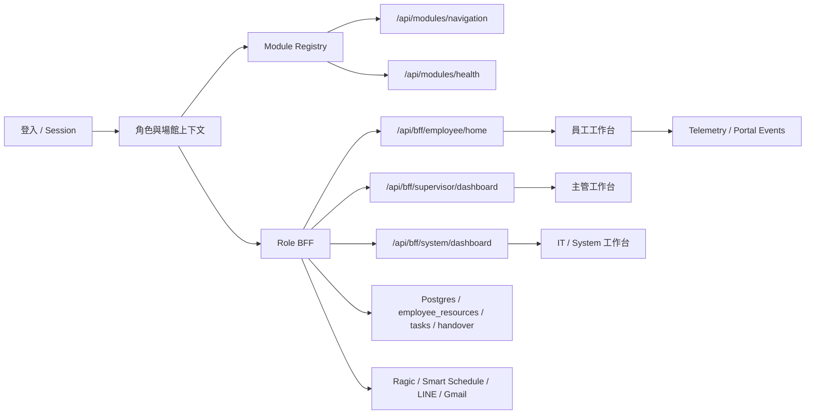

# 駿斯 CMS 施工地圖

更新時間：2026-04-29

## 1. 目前架構主線

專案目前已收斂到 Modular Monolith + Module Registry + BFF 的方向。舊路由仍保留，但新功能應先進 module registry，再接 BFF / API / UI。

後續施工以 `docs/PHASE_TOPOLOGY_MAP.md` 為拓樸主圖：先判斷所在 Phase，再動 schema / BFF / API / UI，避免功能只完成單層接線。驗收門檻以 `docs/PHASE_ACCEPTANCE_GATES.md` 為準。施工技能選型以 `docs/SKILL_ASSISTED_CONSTRUCTION_ROUTER.md` 為準，必要時先用 VoltAgent `awesome-agent-skills` 與 `npx skills find` 查技能，再開始改碼。UI/UX 類施工另以 `docs/UIUX_SKILL_REVIEW_PROTOCOL.md` 為硬閘門。



## 2. 完成度快照

由 `scripts/module-registry-check.ts` 與 `scripts/module-smoke.ts` 盤點：

| 項目 | 數量 / 狀態 |
|---|---:|
| registry modules | 42 |
| descriptors | 50 |
| implemented | 11 |
| partial | 21 |
| planned | 4 |
| legacy | 4 |
| external | 2 |
| employee nav | 6 |
| supervisor nav | 21 |
| system nav | 18 |

仍未接 BFF 的 registry module：

- `gmail-integration`
- `file-upload-export`
- `legacy-users`
- `user-role-snapshots`

## 3. 員工端施工狀態

| 模組 | 目前狀態 | 角色 | UI | BFF / API | 資料來源 | 下一步 |
|---|---|---|---|---|---|---|
| 首頁 | partial | 員工 | 已依示意圖重排 | `/api/bff/employee/home` | BFF 聚合 | 補真實資料與更多 empty/not_connected 邊界 |
| 交辦事項 / 櫃台交接 | partial | 員工 / 主管 | 首頁卡 + 完整頁 + drawer | `/api/handover`, `/api/bff/employee/handover/*` | `operational_handovers` | 部署後驗證 DB 寫入與跨班排序 |
| 活動檔期 / 課程快訊 | partial -> usable | 員工 / 主管 | 深藍活動卡片 + 詳情頁 | `employee_resources category=event` | Postgres | 部署套用 `0004` 後驗證圖片 URL、起訖時間與詳情頁 |
| 常用文件 | partial -> usable | 員工 | Notion-like link database | `/api/portal/employee-resources` | `employee_resources category=document` | 部署驗證新增分類、排序、點名報到 deep link |
| 個人工作記事 / 便利貼 | partial -> usable | 員工 | 快速新增 drawer + 完整頁 | `/api/portal/employee-resources` | `employee_resources category=sticky_note` | 部署驗證選填日期時間、手機體驗 |
| 相關問題詢問 | planned | 員工 / 主管 | 入口存在 | 未接正式 API | none | 不建立 RAG 前先做 FAQ CRUD |
| 點名 / 報到 | deep-link utility | 員工 | 從主導覽移除 | 仍保留 `/employee/checkins` | 外部 / 未接線 | 由常用文件連結進入 |
| 今日班表 | external / partial | 員工 | 首頁預覽卡 | `/api/bff/employee/shifts/today` | Smart Schedule | 接 Replit / schedule source 後驗證 |
| 員工教材 | usable / pending Replit flow | 員工 / 主管 / IT | 員工查閱、主管管理、system 觀看紀錄 | `employee_resources category=training` + `ui_events` | Postgres | Replit 已通過後持續補 UI polish |

## 4. 主管端施工狀態

| 模組 | 目前狀態 | 作用 | 下一步 |
|---|---|---|---|
| 主管首頁 | partial -> usable overview | 主管摘要、授權場館 overview、主理人、人力、交辦與任務摘要 | 補 facility detail 下鑽頁 |
| 任務 | partial | 主管派發與管理同館 task | 部署 DB 驗證 |
| 公告 | partial | 公告治理與發布 | 收斂審核流程與員工已讀狀態 |
| 櫃台交接 | partial | 主管查看與管理交接 | 補篩選與跨館權限 |
| 員工教材 | partial | 主管新增/編輯教材，員工查閱觀看 | 部署 DB 驗證 `TRAINING_VIEW` 寫入 |

## 5. IT / System 施工狀態

| 模組 | 目前狀態 | 作用 | 下一步 |
|---|---|---|---|
| System dashboard | partial | 系統健康與總覽 | 接更多真實 observability |
| Module Registry / Health | usable | 查看模組、導覽、健康狀態 | 補權限收斂到 SYSTEM_ADMIN |
| Raw inspector | planned / partial | 原始資料檢查 | 限制權限與查詢範圍 |
| Telemetry / Audit | partial -> wired | UI events、client errors、audit | 部署後驗證 domain writes 寫入 `audit_logs` row |
| 員工教材觀看紀錄 | partial | IT 看誰看過教材 | 部署 DB 驗證排行與最近觀看 |

## 6. 員工教材建議施工圖

不要另開孤立 CMS。建議沿用：

- `employee_resources category=training`
- `sub_category`：影片 / 圖片 / 注意事項 / SOP / 其他
- `url`：影片、圖片或文件連結
- `content`：教材說明或注意事項
- `ui_events action_type=TRAINING_VIEW`：記錄誰看過

角色分工：

| 角色 | 權限 |
|---|---|
| 員工 | 查看、播放影片、看圖片與注意事項 |
| 主管 | 新增、編輯、刪除同館教材 |
| IT / System | 查看教材清單與觀看紀錄 |

建議新增路由：

- `/employee/training`
- `/supervisor/training`
- `/system/training-views`

建議新增 API：

- `GET /api/portal/employee-resources?category=training`
- `POST /api/portal/employee-resources` with `category=training`
- `PATCH /api/portal/employee-resources/:id`
- `DELETE /api/portal/employee-resources/:id`
- `POST /api/telemetry/ui-events` with `actionType=TRAINING_VIEW`
- `GET /api/telemetry/training-views`

## 7. 當前可部署風險

| 風險 | 狀態 |
|---|---|
| 本機原生 Node 跑 npm script 會無輸出 exit 1 | 已知環境問題；bundled Node 可通過 |
| 工作區 dirty 檔案很多 | 推送前需整理 staging，避免截圖/output 一起上傳 |
| 部分功能本機無 DATABASE_URL | 本機只能驗 UI 與 DTO；寫入需 Replit DB 驗證 |
| telemetry 仍有 memory repository fallback | mock 模式使用；real/neon 模式已走 DB-backed repository，需 Replit 實資料驗證 |
| 外部 Smart Schedule / Ragic 實資料需部署 secrets | 本機 mock / fallback 已接，正式需 Replit Secret |

## 8. 下一輪建議順序

依 `docs/PHASE_TOPOLOGY_MAP.md`，目前先回到 Phase 0 的寫入路徑補強，再進 Phase 1/2。

已完成：

- Phase 0.1a：schema / write-path audit。
- Phase 0.1b：additive 5W1H schema + metadata helper。
- Phase 0.1c 第一棒：`quick_links` create/update 使用 metadata helper。
- Phase 0.1c 第二棒：`employee_resources` create/update 使用 metadata helper，`sticky_note` 預設 private。
- Phase 0.1c 第三棒：`operational_handovers` create/update/report 使用 metadata helper。
- Phase 0.1c 第四棒：`system_announcements` create/update 使用 metadata helper，建立者、角色、來源、發布者與更新者可追蹤。
- Phase 0.1c 第五棒：`tasks` create/update/status 使用 metadata，建立來源、建立角色、主管派發者、派發時間、更新者可追蹤。
- Phase 0.1c 第六棒：`handover_entries` legacy create 補 `createdByRole/source`，舊交接資料不再只有作者欄位。
- Phase 0.1c 第七棒：`anomaly_reports` create/resolve/batch resolve 補外部來源、場館、處理者、處理時間與更新者；未登入 legacy 操作先標為 `legacy-anonymous`，不改現有權限行為。
- Phase 0.1c 第八棒：`notification_recipients` create/update 使用 metadata helper，異常通知收件者設定可追蹤建立者、角色、來源、更新者與場館。
- Phase 0 T0.1：`docs/audits/audit-log-write-verification.md` 已確認 DB-backed `recordAudit()` 存在，但五棒 domain writes 原本未呼叫 audit。
- Phase 0 T0.1.5：`quick_links`、`employee_resources`、`operational_handovers`、`system_announcements`、`tasks update/status` 共 11 個成功寫入點已補 `recordAudit()`，並由 `scripts/module-smoke.ts` 鎖定 action 防回歸。
- Phase 0 T0.1.6：`tasks create` 改用 `withTaskCreateMetadata()`，並在建立成功後寫 `TASK_CREATED` audit；`audit-writer.ts` reserved dead code 已收斂，保留 `AuditEventInput` 型別契約。
- Phase 0 Closure Batch：`handover_entries` create、`anomaly_reports` create/resolve/batch resolve、`notification_recipients` create/update/delete 已補 audit；`HANDOVER_ENTRY_UPDATED` 因沒有 update endpoint 已在 summary 標記 skipped。
- Phase 1 教材閉環第一版：員工端只讀觀看、主管端教材管理、system 端觀看紀錄，`TRAINING_VIEW` payload/resourceId 已對齊。
- Phase 1 教材閉環 smoke：`scripts/module-smoke.ts` 已檢查員工端送出穩定 string `resourceId`，以及 telemetry 報表相容舊 number payload。
- Phase 1 教材部署驗收腳本：`npm run check:training-flow` 已新增，部署後用登入 Cookie 驗證「新增教材 -> employee BFF -> TRAINING_VIEW -> system 報表 -> 清理測試教材」。
- Phase 1 UIUX 第一輪：對照 `ui-ux-pro-max` 與 Vercel Web Interface Guidelines，補強 Employee shell/home/documents/personal-note 的焦點狀態、表單 name、placeholder ellipsis、內部常用文件連結 SPA 導航與手機底部導覽文字保護。
- Phase 0 Replit Gate：commit `94dd613` 已完成部署驗證；`ui_events`、`client_errors`、`audit_logs` 三表真實寫入通過。
- Phase 1 T1.1/T1.3：新增 `docs/audits/employee-ui-consistency.md`；活動檔期新增圖片 URL、事件分類、起訖時間與 `/employee/activity-periods/:id` 詳情模式，並新增 `migrations/0004_employee_resource_event_metadata.sql`。
- Phase 2 T2.1：RoleSwitcher 改為路由跳轉；`/employee/*`、`/supervisor/*`、`/system/*` 由 URL + `grantedRoles` 決定可進入 layout，進入後再同步 `activeRole` 給既有 BFF。
- Phase 2 T2.2：主管首頁新增授權場館 overview grid；BFF 回傳各館人力、當班主理人、未完成交辦與任務摘要，不新增表。

`check:training-flow` 使用方式：

```bash
TRAINING_FLOW_BASE_URL=https://your-replit-url \
TRAINING_FLOW_EMPLOYEE_COOKIE='connect.sid=...' \
TRAINING_FLOW_SYSTEM_COOKIE='connect.sid=...' \
TRAINING_FLOW_FACILITY=xinbei_pool \
npm run check:training-flow
```

如果同一組 Cookie 具有員工/主管與 system 權限，也可以只設定：

```bash
TRAINING_FLOW_COOKIE='connect.sid=...' npm run check:training-flow
```

沒有 system Cookie 時可用 `TRAINING_FLOW_SKIP_SYSTEM_REPORT=1` 只驗證建立、BFF、事件接收；正式上線驗收不建議跳過 system 報表。

下一輪建議順序：

1. Replit DB migration / 實資料 smoke：部署 DB 後跑常用文件、便利貼、教材觀看、異常收件者新增更新，並查 `audit_logs` 對應 row。
2. `/employee` browser multi-viewport review：桌機、平板、手機確認無橫向捲動、抽屜不跳動、底部導覽不溢出。
3. 活動檔期 Replit 驗收：套用 `0004_employee_resource_event_metadata.sql`，新增一筆含圖片 URL / 詳情 URL / 起訖時間的活動，確認列表與詳情頁都正常。
