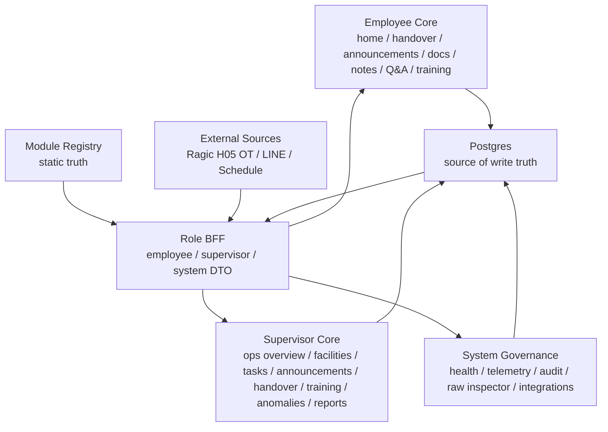

# Current Progress and Remaining Plan

Date: 2026-04-30

## Product Scope Decision

`/supervisor/settings` is removed from the current product surface.

Reason:

- The widget/module configuration experience cannot currently reach the desired quality bar.
- A partial settings builder would create operational confusion and increase support risk.
- The existing domain modules should be stabilized before exposing configuration controls.

Retained only for compatibility:

- `widget_layout_settings` table
- `/api/portal/layout-settings` legacy endpoints
- `widget-layout-settings` registry entry marked as deprecated/background-only

Not in the near-term plan:

- Supervisor settings page
- Widget layout builder
- Module config CRUD
- Role-specific layout editor

## Current State by Role

### Employee

Status: deployment-ready for core daily workflow.

Ready:

- Employee home dashboard
- Handover / front desk tasks
- Announcements read/acknowledge
- Activity periods / course news
- Common documents / Notion-like links
- Personal notes / quick note drawer
- Q&A knowledge base
- Employee training reader

Remaining:

- Production DB verification for Q&A migration `0005`
- Production DB verification for training view telemetry
- Smart Schedule real source validation for today shift
- Weather remains not connected

### Supervisor

Status: deployment-ready for core operations workflow.

Ready:

- `/supervisor` operations overview
- `/supervisor/facilities` authorized facility and staffing view
- `/supervisor/facilities/:facilityKey` facility detail view linked from dashboard and facility cards
- `/supervisor/tasks` task management with right drawer
- `/supervisor/announcements` manual publish, type, pinning, active, publish/expire time, LINE candidate review
- `/supervisor/handover` kanban-style handover management without shift input
- `/supervisor/training` training material management
- `/supervisor/anomalies` anomaly review with resolve/reopen/delete
- `/supervisor/reports` supervisor BFF / portal analytics / CSV export

Recently removed:

- `/supervisor/settings`
- Supervisor widget layout controls

Remaining:

- Replit DB validation after applying migration `0006_supervisor_announcement_controls.sql`
- Production audit row validation for domain writes
- Facility detail deeper employee-view embedding can be improved post-launch
- Formal report DTO can be finalized post-launch

### System / IT

Status: partial, next stabilization area.

Ready / usable:

- Module registry and health inspection
- System overview aliases
- Raw inspector skeleton
- Audit / telemetry table schema and DB-backed write path
- Training view report skeleton

Remaining:

- SYSTEM_ADMIN policy hardening
- Raw inspector query scope and audit guard
- Integration status sourceStatus UI
- Telemetry / audit production row validation after deployment
- Module health should become the primary system control surface

## Current Topology

## Next Work Order

1. Stabilize System / IT pages.
   - Focus: module health, raw inspector guard, integration status, audit visibility.
   - Do not restart module configuration builder.

2. Replit deployment verification.
   - Apply migrations `0005` and `0006`.
   - Verify Q&A rows, announcement controls, training view telemetry, audit rows.

3. Supervisor production acceptance.
   - Re-test all 8 supervisor pages on desktop and mobile.
   - Validate authorized facility filtering with Ragic H05 OT departments.
   - Validate supervisor cannot see unauthorized facilities.

4. Employee final polish.
   - Confirm no homepage visual regression after supervisor changes.
   - Validate common documents, notes, Q&A, and training on mobile.

5. Post-launch improvements.
   - Facility detail drill-down.
   - Formal report DTO.
   - LINE webhook announcement agent.
   - Optional configuration tooling only after a new UX/ADR decision.

## Removed From Near-Term Plan

- `/supervisor/settings`
- Dashboard widget layout editor
- `module_configs` first-version UI
- Supervisor-side module label/order editor
- Multi-role layout builder

These items should not be picked up by future agents unless a new product decision explicitly reopens them.
