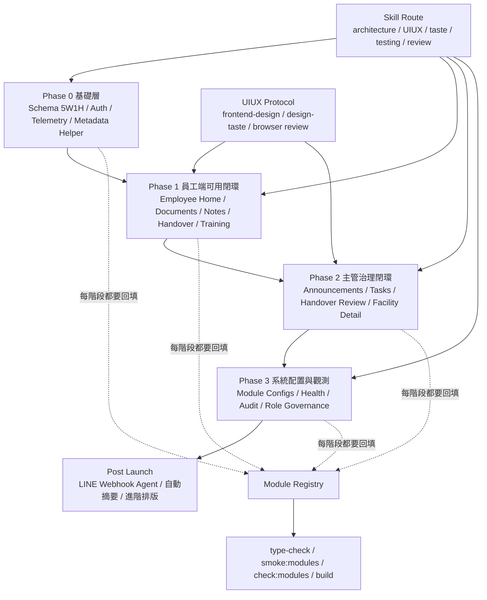
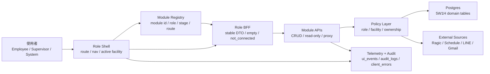
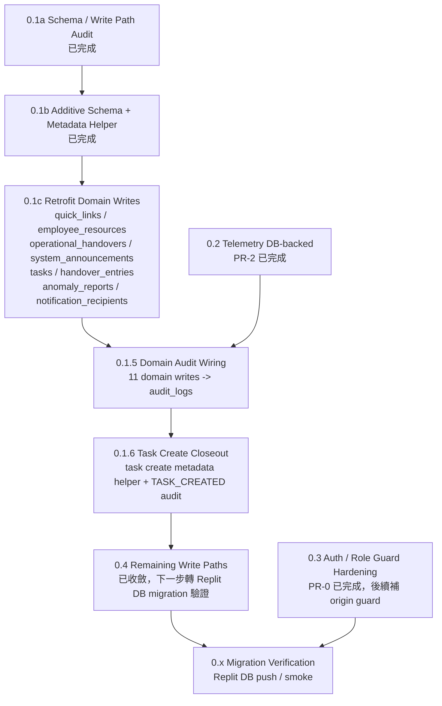
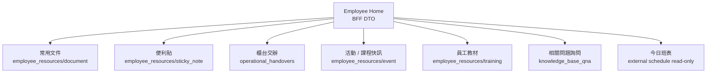
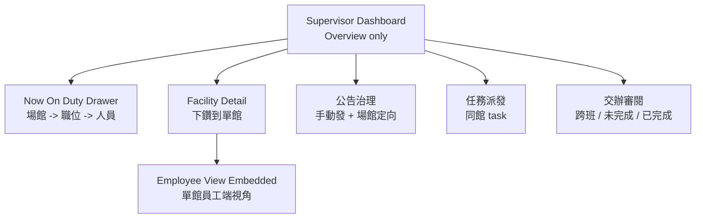
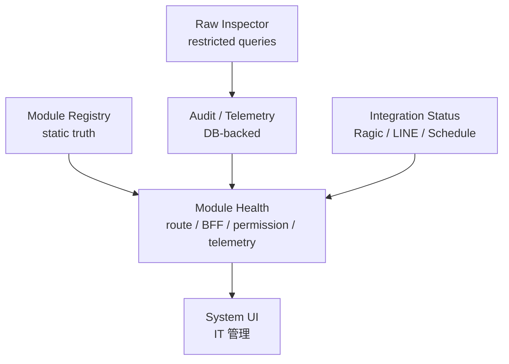

# 駿斯 CMS 四階段施工拓樸圖

更新時間：2026-04-30

目的：把接下來的工程改成「照拓樸施工」，避免 UI、BFF、DB、權限、Telemetry 各自前進但沒有閉環。任何新功能都必須先確認所在階段、資料來源、角色邊界、BFF 契約與驗收門檻。

關鍵驗收與極端情況驗收請看 `docs/PHASE_ACCEPTANCE_GATES.md`。拓樸決定施工順序，驗收門檻決定是否可進下一刀。

施工技能路由請看 `docs/SKILL_ASSISTED_CONSTRUCTION_ROUTER.md`。每一刀先判斷 Phase，再決定要啟用的 skill，最後才動 schema / BFF / API / UI。

所有 UI/UX 類施工必須再對照 `docs/UIUX_SKILL_REVIEW_PROTOCOL.md`。員工端不是只求可用，而是要做到足夠好用、好看、穩定，讓員工日常上班自然依賴。

## 1. 四階段總覽

## 2. 分層拓樸

規則：

- UI 不直接拼外部資料，只吃 BFF 或本平台 API。
- API 寫 domain table 時要帶 5W1H metadata。
- BFF 不應該成為寫入層；BFF 負責 DTO 聚合、狀態保護、錯誤隔離。
- `localStorage` 只能存 UI 偏好，不可存 session / role / facility truth。
- 每個 module 都要在 registry、navigation、health、completion matrix 留痕。

## 3. Phase 0：基礎層

目標：把底層資料、權限、觀測打穩，讓後續模組接線不再變成孤立 UI。

已完成註記：

- `0.1a`：`docs/audits/phase-0-schema-and-writes.md`
- `0.1b`：`migrations/0003_domain_5w1h_metadata.sql`、`server/shared/data/write-metadata.ts`
- `0.1c 第一棒`：`quick_links` create/update 使用 metadata helper
- `0.1c 第二棒`：`employee_resources` create/update 使用 metadata helper，`sticky_note` 預設 private
- `0.1c 第三棒`：`operational_handovers` create/update/report 使用 metadata helper
- `0.1c 第四棒`：`system_announcements` create/update 使用 metadata helper
- `0.1c 第五棒`：`tasks` create/update/status 使用 metadata，並記錄主管派發者與派發時間
- `0.1c 第六棒`：`handover_entries` legacy create 補 `createdByRole/source`
- `0.1c 第七棒`：`anomaly_reports` create/resolve/batch resolve 補 source、facility、resolvedBy、updatedBy
- `0.1c 第八棒`：`notification_recipients` create/update 使用 metadata helper
- `0.1.5`：五棒 domain writes 成功後補 `recordAudit()`，涵蓋 `quick_links`、`employee_resources`、`operational_handovers`、`system_announcements`、`tasks update/status` 共 11 個寫入點
- `0.1.6`：`tasks create` 改走 `withTaskCreateMetadata()`，成功建立後補 `TASK_CREATED` audit；`audit-writer.ts` 移除未接線 reserved writer，只保留 repository 使用的 `AuditEventInput`
- `Phase 0 Closure Batch`：`handover_entries` create、`anomaly_reports` create/resolve/batch resolve、`notification_recipients` create/update/delete 已補 audit；`HANDOVER_ENTRY_UPDATED` 因無 update endpoint 標記 skipped
- `Phase 0 Replit Gate`：commit `94dd613` 已由部署環境驗證通過；`ui_events`、`client_errors`、`audit_logs` 三表皆完成真實寫入，`CLIENT_ERROR_REPORTED` audit row 已確認 actor / role / facility / correlation_id。
- `Phase 1 UIUX 第一輪`：Employee 首頁 / shell / documents / notes 補焦點狀態、表單 name、placeholder ellipsis、內部文件連結 SPA 導航、手機底部導覽文字截斷保護

下一個 Phase 0 候選：

1. 權限 guard 收斂：legacy 管理 API 逐步加上 supervisor/system guard。
2. 後續 DB migration 驗證：從 Phase 1 起每個新增 migration 都必須在 Replit 套用並查真實 row。

Phase 0 出口條件：

- 所有高頻寫入路徑都有 actor、role、facility、source、updated metadata。
- smoke 規則能抓到繞過 helper 的回歸。
- Replit DB migration 跑通，不只本機 schema 通過。

## 4. Phase 1：員工端可用閉環

目標：員工端「能上的都上上去」，但每個模組要有資料真相與狀態，不塞假資料。

施工順序：

1. 常用文件：分類自訂、排序偏好、內部連結直接開啟。
2. 便利貼：快速新增、選填日期時間、最近與即將到期列表。
3. 櫃台交辦：新增、完成、已完成查詢、剩餘時間排序。
4. 活動 / 課程快訊：圖片 URL、分類 filter、詳情頁。
5. 員工教材：影片 / 圖片 / 注意事項查閱，觀看事件落 telemetry。
6. 相關問題詢問：Q&A CRUD、可自問自答、首頁模糊搜尋。
7. Employee UIUX 全面審查：用 `web-design-reviewer`、`design-taste-frontend`、`frontend-design` 重新審 `/employee` 核心頁。

已完成註記：

- `Employee UIUX 第一輪`：對照 `ui-ux-pro-max` 與 Vercel Web Interface Guidelines，補強焦點狀態、表單可及性、SPA 內部文件連結、手機導覽長文字保護與 loading ellipsis。
- `T1.1 Employee UI Audit`：新增 `docs/audits/employee-ui-consistency.md`，記錄 `/employee/*` 頁面盤點、已修項與殘留 UI debt。
- `T1.3 活動卡片強化`：`employee_resources` 補 `image_url/event_category/event_start_at/event_end_at` nullable 欄位，Employee BFF `CampaignSummary` 補圖片、類型、起訖時間，`/employee/activity-periods/:id` 新增詳情模式。
- `T1.4 相關問題詢問`：新增 `knowledge_base_qna` table、`/employee/qna` 問答資料庫頁、`/api/portal/knowledge-base-qna` CRUD、audit actions，並把 Q&A 問題/答案/分類/標籤接進 `/api/bff/employee/search`。

Phase 1 出口條件：

- `/employee` 首頁每張卡都有 `ready / empty / not_connected / error`。
- 員工左導覽與 quick actions 都由 registry / API truth 產生。
- 常用文件、便利貼、交辦、活動、教材都能在 Replit DB 驗證新增與查詢。
- 相關問題詢問可在 Replit DB 驗證新增、補答、刪除，且首頁搜尋能查到 Q&A。
- `/employee`、`/employee/handover`、`/employee/documents`、`/employee/personal-note` 通過 UI/UX skill review 與多 viewport browser review。

## 5. Phase 2：主管治理閉環

目標：主管首頁只放 overview；完整員工端視角放在場館 detail 下鑽，避免主管首頁超載。

決策註記：

- 主管首頁不直接塞完整員工首頁。
- 下鑽到場館 detail 時，才呈現該館員工端視角。
- 公告上線前先做手動發布 + 場館定向。
- LINE webhook agent 放到 post-launch，不阻塞首版上線。

Phase 2 出口條件：

- supervisor BFF 只回授權場館。
- 主管可管理公告、任務、交辦，但不污染員工個人資料。
- 公告有已讀 / 確認狀態，員工端只讀。

已完成註記：

- `T2.1 Supervisor Layout Refactor`：Role tabs 改為 URL navigation；`WorkbenchAuthGate` 依 URL + `grantedRoles` 做前端 route guard，進入授權 layout 後同步 `activeRole`，維持既有 BFF 相容。
- `T2.2 Supervisor Home Overview`：`/api/bff/supervisor/dashboard` 新增 authorized facility overview section，主管首頁先顯示各館主理人、人力、未完成交辦與任務，detail 下鑽留後續。
- `T2.3 Supervisor UIUX Shell Alignment`：參考 `主管端ui.zip` 與員工端完成版，主管/system 共用 `RoleShell` 改為全視窗自適應工作台；主管導覽收斂為營運總覽、場館、任務、公告、櫃台交接、員工教材、異常審核、報表。`/supervisor/settings` 與 widget layout 編輯已自本階段移除；主管首頁桌機版只保留 KPI、授權場館狀態、快速操作、未完成交班 Top 5，場館營運模組只保留在手機端。
- `T2.4 Supervisor Core Flow Hardening`：任務管理改為列表 + 右側新增抽屜；場館頁新增授權場館卡片與場館篩選；主管櫃台交接改成不要求固定班別，只依館別、內容、到期時間與狀態治理。`module-smoke` 已鎖定這些防回歸條件。
- `T2.5 Supervisor Announcement Closure`：公告管理從候選審核頁升級為完整主管公告工作台，可手動發布、選類型、置頂、啟用/停用、設定發布時間與下架時間；員工 BFF 會依 pinned/type/time 排序與顯示。
- `T2.6 Supervisor Report Closure`：報表頁不再呼叫 system-only overview，改由 supervisor BFF 與 portal analytics 組成，並提供可下載 CSV。
- `T2.7 Supervisor Facility Duty Drawer`：主管首頁場館模組新增「查看當班人員」入口；右側抽屜依營運中場館、職位、當班人員分層顯示，資料只吃 supervisor BFF，不在 component 直連外部排班 API。

## 6. Phase 3：系統觀測與治理

目標：上線前先把 system-only health、audit、raw inspector 與 integration status 收斂到可驗收狀態。`module_configs` / widget layout builder 已移出近期計畫，不作為首版上線阻塞項。

上線前範圍：

- module health 正式顯示
- audit / telemetry DB-backed 驗證
- raw inspector 權限與查詢範圍限制
- integration status sourceStatus 顯示
- system-only 管理頁

上線後範圍：

- 完整 module CRUD（需重新評估產品必要性）
- 複雜排版設定（已暫停，不列入近期施工）
- 多角色差異化 layout builder（已暫停，不列入近期施工）
- LINE webhook agent / 自動摘要 / AI assist

Phase 3 出口條件：

- IT 可以看 module health。
- 所有變更寫 audit。
- employee / supervisor 不可看到 system-only config。

## 7. 每輪施工檢查表

每次開工前：

1. 確認本輪屬於 Phase 0 / 1 / 2 / 3 哪個節點。
2. 對照 `docs/SKILL_ASSISTED_CONSTRUCTION_ROUTER.md`，確認本輪要啟用的 skill。
3. 若涉及 UI/UX，先對照 `docs/UIUX_SKILL_REVIEW_PROTOCOL.md`。
4. 若現有技能不足，先用 `npx skills find <query>` 搜尋，不自行亂補流程。
5. 確認 module registry 是否已有 descriptor。
6. 確認資料來源：Postgres / external / none / not_connected。
7. 確認 role：employee / supervisor / system / SYSTEM_ADMIN。
8. 確認 BFF DTO 是否穩定。
9. 確認寫入是否帶 5W1H metadata。
10. 確認 telemetry / audit 是否需要落地。
11. 完成後跑對應 smoke / check。
12. 對照 `docs/PHASE_ACCEPTANCE_GATES.md` 的關鍵與極端情況驗收點。

每次完成後：

1. 更新 `docs/CONSTRUCTION_MAP.md`。
2. 若改 module，更新 registry / completion matrix。
3. 若改資料表，更新 migration 與 schema note。
4. 若改 BFF，更新 DTO 文件或 ADR。
5. 若新增風險，加入可部署風險表。

## 8. 下一刀建議

在 0.1c domain metadata 已收斂、Employee UIUX 第一輪已完成後，下一刀建議走：

1. Replit DB migration / 實資料 smoke：部署 DB 後跑常用文件、便利貼、教材觀看、異常收件者新增更新。
2. `/employee` browser multi-viewport review：桌機、平板、手機確認無橫向捲動、抽屜不跳動、底部導覽不溢出。
3. Activity / 課程圖片卡片：補圖片 URL、詳情頁、空狀態與分類 filter。

不建議現在先做：

- LINE webhook agent：放 post-launch。
- 完整 module layout builder：已暫停；除非重新完成 UX/ADR 決策，否則不要排入下一輪。
- Redis session store：目前先走 Postgres / cookie session 路線。
