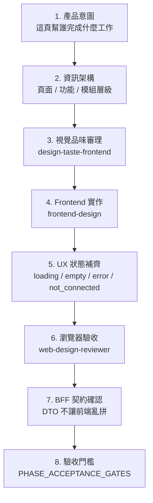

# 駿斯 CMS UI/UX Skill Review Protocol

更新時間：2026-04-29

目的：目前員工端與後續主管端不能只達到「功能可用」。駿斯 CMS 要成為員工每天上班會自然依賴的工具，因此 UI/UX 施工必須用專門 skill 做審理，而不是只靠一般工程直覺。

## 1. 已安裝 UI/UX Skill

本輪新增安裝：

| Skill | 來源 | 用途 |
|---|---|---|
| `frontend-design` | `anthropics/skills@frontend-design` | 建立高水準、非 generic 的 production frontend。用於頁面重設計、核心卡片、完整工作台體驗。 |
| `design-taste-frontend` | `leonxlnx/taste-skill@design-taste-frontend` | 強化視覺品味、反 AI 味、設計工程硬規則。用於修掉廉價感、空泛感、過度卡片化、間距失衡。 |
| `web-design-reviewer` | `github/awesome-copilot@web-design-reviewer` | 實際用瀏覽器多 viewport 檢查破版、重疊、對比、響應式與互動問題。 |

既有可搭配技能：

| Skill | 用途 |
|---|---|
| `ui-ux-pro-max` | UX 規則、可用性、觸控、動效、空狀態、錯誤狀態 |
| `web-design-guidelines` | Web UI 規範、可讀性、可訪問性與一致性 |
| `product-designer` | 使用者流程、產品定位、資訊架構 |
| `ui-design-system` | 設計系統、元件一致性 |

## 2. UI/UX 施工強制流程

任何會改變「畫面、互動、頁面流程、導航、卡片、表單、modal/drawer」的任務，都必須照這個順序：

## 3. 三層思考框架

### 3.1 功能層

先問：

- 使用者這裡要完成什麼？
- 這個動作高頻還是低頻？
- 主要 CTA 是什麼？次要 CTA 是否可以收起？
- 是否需要快速新增、查看全部、篩選、搜尋、排序？
- 失敗時能否保留輸入？

功能層不通過時，不准先美化。

### 3.2 頁面層

先問：

- 首屏最重要的 1-3 件事是什麼？
- 這頁是掃描型、填寫型、管理型、閱讀型，還是監控型？
- PC / Tablet / Mobile 的資訊優先級是否不同？
- 是否有過多卡片造成空泛？
- 是否有固定 header/sidebar 導致內容被壓縮？

頁面層不通過時，不准新增孤立元件。

### 3.3 模組層

先問：

- module registry 是否定義此模組？
- BFF DTO 是否穩定？
- 模組在 employee / supervisor / system 的視角差異是什麼？
- 模組是否有完整 `ready / empty / not_connected / error`？
- 模組是否有 telemetry / audit？

模組層不通過時，不准宣稱完成。

## 4. Employee 端 UI/UX 品質標準

員工端必須做到：

- 開頁 3 秒內知道今天要處理什麼。
- 常用動作 1-2 次點擊內完成。
- 快速新增不跳頁，modal/drawer 直接聚焦輸入。
- 首頁不是「卡片堆疊」，而是工作流儀表板。
- 卡片高度、背景、留白要有目的，不能出現大片空泛。
- 無資料時看起來像正式 empty state，不像壞掉。
- 每個 CTA 文案要是動詞或明確目的，例如「查看全部」、「新增交辦事項」。
- 手機端不依賴 hover，不出現水平捲動，不出現雙 scrollbar。

## 5. 視覺設計硬規則

採用 `design-taste-frontend` 的硬規則，針對本專案落地為：

- 禁止廉價 AI 紫藍漸層。
- 禁止 emoji 當功能 icon。
- 禁止為了好看到處加 glow / orb / bokeh。
- 禁止所有模組都長成同一張白卡。
- Dashboard 不使用 serif 字體。
- 主要容器不使用 `h-screen`，改用 `min-h-dvh` 或穩定 layout。
- 動效只能用 `transform` / `opacity`，不得造成 layout shift。
- form 必須有外部 label，不能只靠 placeholder。
- 一個畫面只能有一個主要 CTA。

## 6. 瀏覽器驗收規則

任何 UI 改動完成後，使用 `web-design-reviewer` 或等價 browser QA 走：

| Viewport | 用途 |
|---|---|
| 375 x 812 | iPhone 常見尺寸 |
| 768 x 1024 | 平板 |
| 1366 x 768 | 常見筆電 |
| 1920 x 1080 | 寬桌機 |

必查：

- 元素是否重疊。
- 文字是否被截斷。
- 是否有水平捲動。
- modal/drawer 是否跳動。
- fixed header/sidebar 是否擋住內容。
- touch target 是否足夠。
- loading/empty/error/not_connected 是否有視覺品質。

## 7. BFF 與 UI 的分工

BFF 負責：

- role/facility 權限裁定。
- 聚合資料來源。
- 回傳穩定 DTO。
- 把錯誤轉成 section 狀態。
- 回 `sourceStatus`。

UI 負責：

- 高水準視覺呈現。
- 快速操作體驗。
- 清楚 loading/empty/error/not_connected。
- 合理響應式布局。
- 不自行拼 external API。
- 不把假資料包裝成完成。

## 8. UI/UX Review Checklist

每次 UI PR 完成前必問：

1. 這頁是否有明確使用者任務？
2. 首屏是否只放最重要的東西？
3. 是否有一個清楚主 CTA？
4. 是否有 loading / empty / not_connected / error？
5. 是否沒有 mock 假裝正式資料？
6. 是否手機與桌機都不破版？
7. 是否沒有大面積空泛白卡？
8. 是否沒有重疊、跳動、雙 scrollbar？
9. 是否有足夠觸控面積？
10. 是否有 BFF DTO，而不是前端拼資料？

未通過任一項，不准標記 UI 完成。

## 9. 下一步落地

建議下一個 UI/UX 施工節點：

1. 用 `web-design-reviewer` 對 `/employee`、`/employee/handover`、`/employee/documents`、`/employee/personal-note` 做多 viewport 截圖審查。
2. 用 `design-taste-frontend` 重審 Employee Home：解決空泛、卡片同質、視覺層級弱。
3. 用 `frontend-design` 重做核心模組卡片系統，不大改架構，但提升視覺品質。
4. 對每個頁面補 `ready / empty / not_connected / error` 的高質感狀態。

